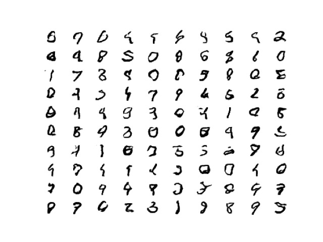

# Creating a GAN for MNIST digit generation

GANs or Generative Adverserial Networks consist of two neural networks, one that is in charge of generating some output and the other tries to differentiate it from a real data sample. Through multiple training iterations in an adverserial manner, the generator learns to generate data similar to the real(provided) data.

Theoretically GANs aim to match the output distribution of the generator to the real data distribution as closely as possible, reducing the entropy between the two distributions.

GANs were introduced in 2014 by Ian Goodfellow and his team at Google, and have since improved immensely with many variations such as DCGAN, WGAN, SAGAN, FlowGAN and more. Some interesting ideas are also proposed, such as multiple networks instead of just two.

In this repo I have created a simple GAN and added improvements such as implementing WGANs. The model is deployed on a [Google Cloud instance](https://asia-south2-mlops-414211.cloudfunctions.net/function-1) and can be accessed through the interface [here](https://ubiquitous-scone-c755a1.netlify.app/)

A sample of generated digits by the simple GAN is 

The docs of the project can be found [here](https://github.com/pranshu-raj-211/mnist_GAN/tree/main/docs).

To run the project on a local machine, clone the repo, execute the command -
`pip install -r requirements.txt` 
in a terminal while inside the project directory. This installs all dependencies for the project.

After this step the flask client webapp needs to be run using the [url](https://asia-south2-mlops-414211.cloudfunctions.net/function-1) for the deployed model.